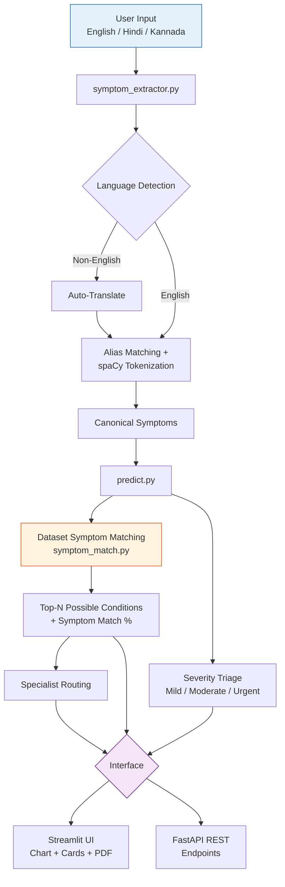

<div align="center">

# 🩺 MediCheck

### AI-Powered Multilingual Symptom Checker

**Describe your symptoms in English, Hindi, or Kannada — get possible conditions, severity triage, and a specialist recommendation.**

### 🚀 [Live Demo → medicheck-ml.streamlit.app](https://medicheck-ml.streamlit.app/)

[](https://medicheck-ml.streamlit.app/)
[](https://python.org)
[](https://scikit-learn.org)
[](https://streamlit.io)
[](https://fastapi.tiangolo.com)
[](#license)

[Live Demo](https://medicheck-ml.streamlit.app/) · [Screenshots](#-screenshots) · [How It Works](#-how-it-works) · [Model](#-model) · [Setup](#-setup--run-locally) · [Deploy](#-deploying-to-streamlit-cloud)

</div>

> ⚠️ **Educational project, not medical advice.** MediCheck lists *possible* conditions that match the symptoms you enter. It is not a diagnosis. Consult a qualified doctor for any health concern, and contact emergency services if it may be an emergency.

---

## 📖 Overview

**MediCheck** takes a free-text description of symptoms and returns possible conditions, a severity/risk assessment, recommended specialists, and a downloadable PDF report — with no rigid dropdown menus. Say what's wrong in your own words, in English, Hindi, or Kannada, and the system detects the language, extracts the underlying symptoms, and matches them against a reference symptom–disease dataset.

👉 **Try it live: [medicheck-ml.streamlit.app](https://medicheck-ml.streamlit.app/)**

---

## ✨ Features

- 🌐 **Multilingual input** — detects the input language and auto-translates non-English text before processing (Hindi/Kannada tested)
- 🧠 **Natural-language symptom extraction** — matches both exact dataset terms and everyday phrasing ("can't breathe" → `breathlessness`) via an alias map + spaCy tokenization fallback
- 🔬 **Sparse-input disease matching** — ranks conditions by how well the *entered* symptoms fit the reference dataset, so symptoms you didn't mention are not treated as symptoms you don't have
- 🚦 **Severity triage** — Mild / Moderate / Urgent, based on per-symptom severity weights, plus a hard **risk flag** for symptoms commonly associated with medical emergencies (e.g. chest pain, breathlessness) so a single serious symptom isn't diluted by an average
- 👨‍⚕️ **Specialist routing** — maps each possible condition to the relevant type of doctor
- 📊 **Symptom Match chart & specialist cards** — visual comparison of the top candidate conditions, not just a text list
- 📄 **PDF report export** — generates a shareable report with patient context, detected symptoms, severity, and precautions
- 🗃️ **Query logging** — anonymized symptom/prediction/severity log in SQLite
- 🔌 **Optional REST API** — the same prediction pipeline exposed over FastAPI, independent of the Streamlit UI

---

## 📱 Screenshots

| Symptom Checker Interface | Prediction & Match Analysis |
| --------------------------- | ----------------------------------- |
| .png) | .png) |

| Severity Assessment & Specialist Recommendation | Model Comparison Visualization |
| -------------------------------------------------- | --------------------------------- |
| .png) | .png) |

> User enters symptoms in English, Hindi, or Kannada → the system detects the language, extracts symptoms, ranks possible conditions by symptom match, classifies severity (Mild / Moderate / Urgent), and recommends the relevant specialist.

---

## 🏗️ How It Works



All pipeline components (`train.py`, `predict.py`, `symptom_extractor.py`, `symptom_match.py`) share a single symptom-normalization function in `model/utils.py`, so symptom names are always in the same format everywhere. See [CHANGELOG.md](CHANGELOG.md) for why this mattered.

### Training Pipeline


### Inference Pipeline


> The pipeline diagrams above show the original classifier-based flow. The live app now ranks conditions with dataset symptom matching (see [Model](#-model)).

---

## 🔬 Model

Trained on a public Kaggle disease–symptom dataset (4,920 rows, 41 diseases, 131 unique symptoms across up to 17 symptom slots per row). `train.py` converts those slots into a binary (multi-hot) feature matrix — one column per symptom — and compares three classifiers:

| Model | Test Accuracy (full symptom profiles) |
|---|---|
| Random Forest | 100.0% |
| Naive Bayes | 100.0% |
| SVM | 100.0% |

> **Why accuracy is at 100%:** the dataset is small, synthetic and cleanly separated, so all three models hit the ceiling. On real clinical data you would expect more separation between models, and cross-validation rather than a single train/test split.

### Why the app ranks by symptom match instead of the classifier

The classifiers are trained on **complete** symptom profiles (typically 8–15 symptoms per row), but real users describe only 1–3 symptoms. Feeding a sparse input to the classifier encodes every unmentioned symptom as "absent", which is not what the user meant. The 100% test accuracy comes from full-profile rows, so it does not validate this sparse-input use case.

For example, `high_fever + headache` appears together in the dataset for Dengue, Typhoid, Malaria, Chicken pox and Common Cold, yet the classifier ranked unrelated diseases such as AIDS and Paralysis highly, even though neither has a single training row with both symptoms.

The app therefore ranks conditions in `model/symptom_match.py` using only evidence from the dataset. For the entered symptoms, each disease gets:

- **Full-match rate** — the share of its dataset rows that contain *all* entered symptoms
- **Coverage** — on average, how many of the entered symptoms appear in its rows

`Symptom Match % = 60% × full-match rate + 40% × coverage`. The 60/40 weighting is a design choice, not a medical finding.

**Symptom Match % is not a probability and not a diagnosis.** It only shows how well the entered symptoms fit the reference dataset, and common symptoms such as fever will match many conditions. The classifiers are still trained and compared by `train.py`; they are not used for the ranking shown in the app.

---

## 📂 Project Structure

```
medicheck/
├── app/streamlit_app.py       # Streamlit UI — single entry point
├── api/main.py                # Optional FastAPI REST endpoints
├── model/
│   ├── train.py                # Builds the binary feature matrix & trains models
│   ├── predict.py               # Ranks conditions, adds severity, specialist, precautions
│   ├── symptom_match.py         # Dataset symptom-match ranking for sparse input
│   ├── symptom_extractor.py     # NLP: translation, alias matching, extraction
│   ├── pdf_report.py            # PDF report generation
│   ├── utils.py                 # Shared symptom normalization (single source of truth)
│   ├── medicheck_model.pkl      # Trained classifier (generated by train.py)
│   ├── label_encoder.pkl        # Disease label encoder (generated)
│   ├── symptom_list.pkl         # Canonical symptom feature list (generated)
│   └── model_results.json       # Model comparison results (generated)
├── data/                       # Source CSVs (dataset, severity, description, precautions)
├── tests/                      # pytest suite (incl. symptom-match tests)
├── requirements.txt
└── .streamlit/config.toml      # Theme
```

---

## 🚀 Setup & Run Locally

```bash
git clone https://github.com/saniasagheer05/Medicheck.git
cd Medicheck
python -m venv venv
source venv/bin/activate        # Windows: venv\Scripts\activate
pip install -r requirements.txt

# (Re)train the model — writes medicheck_model.pkl, label_encoder.pkl,
# symptom_list.pkl, model_results.json into model/. Not required if
# these files are already committed, but useful after changing the data.
python model/train.py

# Run the Streamlit app
streamlit run app/streamlit_app.py
```

Run the test suite:

```bash
pytest tests/ -v
```

Run the optional API instead of/alongside the UI:

```bash
uvicorn api.main:app --reload
# Interactive docs at http://127.0.0.1:8000/docs
```

---

## ☁️ Deploying to Streamlit Cloud

**Live app:** [medicheck-ml.streamlit.app](https://medicheck-ml.streamlit.app/)

1. Push this repo to GitHub (model `.pkl` files must be committed — Streamlit Cloud does not run a training step, it just installs `requirements.txt` and runs the app)
2. Go to [share.streamlit.io](https://share.streamlit.io), click **New app**, and select this repo
3. Set **Main file path** to `app/streamlit_app.py`
4. Deploy — first boot may take a minute while spaCy's model wheel installs

---

## ⚠️ Limitations

- Symptom extraction is alias/keyword-based, not a medical NLP model — it won't catch every possible phrasing
- Built on a small, synthetic dataset — not validated against real clinical data
- Symptom Match % is a dataset-fit score, not a probability; common symptoms match many conditions, and the score can't tell them apart without more detail
- The classifier comparison uses a single train/test split with no cross-validation, so its results should not be read as real-world accuracy
- Educational project only — not a diagnostic tool

---

## 📄 License

For educational/portfolio use.

---

<div align="center">

Built by **Sania Sagheer**

</div>
