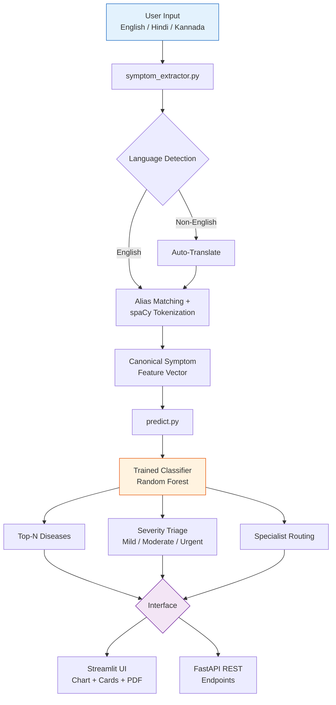

<div align="center">

# 🩺 MediCheck

### AI-Powered Multilingual Symptom Checker

**Describe your symptoms in English, Hindi, or Kannada — get likely conditions, severity triage, and a specialist recommendation.**

[](https://python.org)
[](https://scikit-learn.org)
[](https://streamlit.io)
[](https://fastapi.tiangolo.com)
[](#license)

[Screenshots](#-screenshots) · [How It Works](#-how-it-works) · [Model](#-model) · [Setup](#-setup--run-locally) · [Deploy](#-deploying-to-streamlit-cloud)

</div>

---

## 📖 Overview

**MediCheck** takes a free-text description of symptoms and returns likely conditions, a severity/risk assessment, recommended specialists, and a downloadable PDF report — with no rigid dropdown menus. Say what's wrong in your own words, in English, Hindi, or Kannada, and the system detects the language, extracts the underlying symptoms, and runs them through a trained classifier.

---

## ✨ Features

- 🌐 **Multilingual input** — detects the input language and auto-translates non-English text before processing (Hindi/Kannada tested)
- 🧠 **Natural-language symptom extraction** — matches both exact dataset terms and everyday phrasing ("can't breathe" → `breathlessness`) via an alias map + spaCy tokenization fallback
- 🔬 **Disease prediction** — a scikit-learn classifier trained on a labeled symptom-disease dataset
- 🚦 **Severity triage** — Mild / Moderate / Urgent, based on per-symptom severity weights, plus a hard **risk flag** for symptoms commonly associated with medical emergencies (e.g. chest pain, breathlessness) so a single serious symptom isn't diluted by an average
- 👨‍⚕️ **Specialist routing** — maps each predicted condition to the relevant type of doctor
- 📊 **Confidence chart & specialist cards** — visual comparison of the top candidate conditions, not just a text list
- 📄 **PDF report export** — generates a shareable report with patient context, detected symptoms, severity, and precautions
- 🗃️ **Query logging** — anonymized symptom/prediction/severity log in SQLite
- 🔌 **Optional REST API** — the same prediction pipeline exposed over FastAPI, independent of the Streamlit UI

---

## 📱 Screenshots

| Symptom Checker Interface | Prediction & Confidence Analysis |
| --------------------------- | ----------------------------------- |
| .png) | .png) |

| Severity Assessment & Specialist Recommendation | Model Comparison Visualization |
| -------------------------------------------------- | --------------------------------- |
| .png) | .png) |

> User enters symptoms in English, Hindi, or Kannada → the system detects the language, extracts symptoms, predicts conditions with confidence scores, classifies severity (Mild / Moderate / Urgent), and recommends the relevant specialist.

---

## 🏗️ How It Works



All three pipeline components (`train.py`, `predict.py`, `symptom_extractor.py`) share a single symptom-normalization function in `model/utils.py`, so the feature format used for training always matches the format used at prediction time. See [CHANGELOG.md](CHANGELOG.md) for why this mattered.

### Training Pipeline


### Inference Pipeline


---

## 🔬 Model

Trained on a public Kaggle disease–symptom dataset (4,920 rows, 41 diseases, 131 unique symptoms across up to 17 symptom slots per row). `train.py` converts those slots into a proper binary (multi-hot) feature matrix — one column per symptom — and compares three classifiers:

| Model | Test Accuracy |
|---|---|
| Random Forest | 100.0% |
| Naive Bayes | 100.0% |
| SVM | 100.0% |

The best-performing model (Random Forest, selected automatically by `train.py`) is saved for deployment.

> **Note:** this dataset is small, synthetic, and cleanly-separated, which is why accuracy is at ceiling for all three models — on messier real-world clinical data you'd expect more separation between them, and cross-validation rather than a single train/test split. That's noted here deliberately, since being able to explain *why* a result looks unrealistically perfect is exactly what an interviewer will probe for.

---

## 📂 Project Structure

```
medicheck/
├── app/streamlit_app.py       # Streamlit UI — single entry point
├── api/main.py                # Optional FastAPI REST endpoints
├── model/
│   ├── train.py                # Builds the binary feature matrix & trains models
│   ├── predict.py               # Loads artifacts, runs predictions + severity
│   ├── symptom_extractor.py     # NLP: translation, alias matching, extraction
│   ├── pdf_report.py            # PDF report generation
│   ├── utils.py                 # Shared symptom normalization (single source of truth)
│   ├── medicheck_model.pkl      # Trained classifier (generated by train.py)
│   ├── label_encoder.pkl        # Disease label encoder (generated)
│   ├── symptom_list.pkl         # Canonical symptom feature list (generated)
│   └── model_results.json       # Model comparison results (generated)
├── data/                       # Source CSVs (dataset, severity, description, precautions)
├── tests/                      # pytest suite
├── requirements.txt
└── .streamlit/config.toml      # Theme
```

---

## 🚀 Setup & Run Locally

```bash
git clone https://github.com/saniasagheer05/Medicheck.git
cd Medicheck
python -m venv venv
source venv/bin/activate        # Windows: venv\Scripts\activate
pip install -r requirements.txt

# (Re)train the model — writes medicheck_model.pkl, label_encoder.pkl,
# symptom_list.pkl, model_results.json into model/. Not required if
# these files are already committed, but useful after changing the data.
python model/train.py

# Run the Streamlit app
streamlit run app/streamlit_app.py
```

Run the test suite:

```bash
pytest tests/ -v
```

Run the optional API instead of/alongside the UI:

```bash
uvicorn api.main:app --reload
# Interactive docs at http://127.0.0.1:8000/docs
```

---

## ☁️ Deploying to Streamlit Cloud

1. Push this repo to GitHub (model `.pkl` files must be committed — Streamlit Cloud does not run a training step, it just installs `requirements.txt` and runs the app)
2. Go to [share.streamlit.io](https://share.streamlit.io), click **New app**, and select this repo
3. Set **Main file path** to `app/streamlit_app.py`
4. Deploy — first boot may take a minute while spaCy's model wheel installs

---

## ⚠️ Limitations

- Symptom extraction is alias/keyword-based, not a medical NLP model — it won't catch every possible phrasing
- Trained on a synthetic dataset (see [Model](#-model) above) — not validated against real clinical data

---

## 📄 License

For educational/portfolio use.

---

<div align="center">

Built by **Sania Sagheer**

</div>
